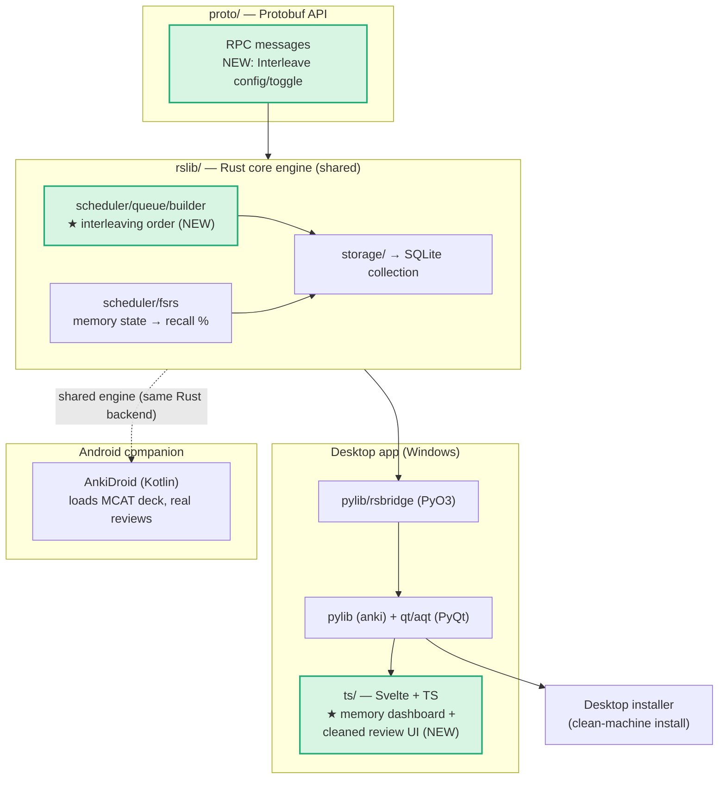

# PRD — Speedrun (MVP)

> A desktop + Android study app **forked from Anki** for the **MCAT**. The MVP
> ("Wednesday core") proves the engine works on both screens with **no AI**:
> a real Rust change (a topic-aware **interleaving scheduler**), pre-seeded
> interleaved MCAT decks, an **honest memory score** (range + give-up rule), and
> an Android companion that runs real reviews on the **same shared Rust engine**.
>
> **Exam:** MCAT (total **472–528**; four sections each scored **118–132**).
> **License:** AGPL-3.0-or-later, with credit to Anki.
>
> See [`Speedrun_ A Desktop + Mobile Study App Built on Anki.md`](./Speedrun_%20A%20Desktop%20+%20Mobile%20Study%20App%20Built%20on%20Anki.md)
> for the full assignment brief, [`Speedrun_Brainlift_MCAT.md`](./Speedrun_Brainlift_MCAT.md)
> for the research/POVs behind these features, and
> [`POST_MVP_ROADMAP.md`](./POST_MVP_ROADMAP.md) for everything intentionally
> deferred past the Wednesday MVP (AI, CARS, two-way sync, performance &
> readiness models, packaging, proofs).

## What is MVP

It is a **forked, source-building Anki** that has been changed _inside the Rust
engine_ and reskinned for MCAT study, plus an **Android companion** that reviews
the same deck on the same engine. **No model calls, no generated cards, no
chatbot** ship in the MVP.

Concretely, the MVP must:

1. **Build Anki from source** on **Windows desktop** and produce a
   **running Android build** (emulator or real device).
2. Contain a **real Rust change running end-to-end**: a **topic-aware
   interleaving scheduler** (new study-queue order), exposed via a **new
   protobuf message** and **called from Python**, with **≥3 Rust unit tests + 1
   Python integration test**, undo intact, and no collection corruption.
3. Run a **review loop on a pre-seeded MCAT deck** that interleaves the first
   three MCAT sections (Bio/Biochem, Chem/Phys, Psych/Soc).
4. Show an **honest memory score**: a point estimate **plus a range**, governed
   by an explicit **give-up rule** (no score shown when data is insufficient).
5. Let users **use their own content**: import their own decks and browse/import
   Anki shared decks (reused Anki functionality).
6. Ship a **desktop installer that runs on a clean machine**.
7. On Android: **load the MCAT deck and run a real review session on the shared
   engine.** _(Two-way sync is NOT required for the MVP — reviewing the same
   deck is.)_

**Success bar:** a pre-med student opens the desktop app, gets an interleaved MCAT
review session driven by our Rust scheduler, sees a memory score that honestly
reports its own uncertainty (or refuses to show one), and can pick the same
review session back up on their Android phone — all with AI switched off.

### Features

**Forked engine & build (the foundation)**

- Anki forked under **AGPL-3.0-or-later** with credit to Anki, building from
  source via the project `justfile` (`just run`, `just check`).
- Desktop build on Windows; Android build via **AnkiDroid** sharing Anki's Rust
  backend.

**Rust change — Topic-aware interleaving scheduler**

- A **new study-queue ordering** that mixes due cards across MCAT topics
  (Bio/Biochem, Chem/Phys, Psych/Soc) within a single session instead of
  reviewing one topic in a block. Motivated directly by **Brainlift SPOV #1
  ("interleaving should be the default in any MCAT study tool")** and the
  interleaving evidence (Rohrer et al.).
- Lives in the Rust core (`rslib/src/scheduler/queue/builder/`), keeps **FSRS
  intervals valid** and **undo working**, and does not corrupt the collection.
- A **new protobuf message/RPC** (in `proto/`) toggles/configures interleaving,
  surfaced to Python via `pylib/rsbridge` and callable from the desktop app.
- **Tests:** ≥3 Rust unit tests (ordering correctness, FSRS-interval
  preservation, undo) + 1 Python test that calls the new RPC end-to-end.
- Because the engine is shared, the change **also ships to the Android build**.

**Decks & content**

- **Pre-seeded interleaved MCAT decks** for Bio/Biochem, Chem/Phys, Psych/Soc,
  tagged by topic so the scheduler can interleave them.
- **Bring-your-own content:** import personal `.apkg` decks and
  browse/import Anki shared decks (existing Anki import path, reused).

**Honest memory score**

- A **memory score** derived from Anki's existing **FSRS memory state**
  (predicted recall / retrievability), aggregated per deck/topic.
- Always shown as a **point estimate + a likely range** (uncertainty band that
  widens with fewer reviews).
- Each score shows: the estimate, the range, **when it was last updated**, and
  the **give-up rule** state.
- **Give-up rule (MVP draft, tunable):** _show no per-topic memory score until
  that topic has **≥20 graded reviews**, and no overall deck score until
  **≥100 graded reviews**._ "A system that knows when it does not know."
  _(The full readiness give-up rule — `≥200 graded reviews AND ≥50% topic
  coverage` — is defined in the roadmap and lands with the readiness model
  post-MVP.)_

**UI improvements**

- A new **memory dashboard** built as **Svelte/TypeScript** components/pages
  under `ts/` (the same stack Anki already uses), reused by both desktop and
  Android webviews.
- A **cleaned-up review screen** for the MCAT review loop.

**Android companion**

- Builds and runs on emulator/device, **loads the MCAT deck**, and runs a **real
  review session on the shared Rust engine** (so the interleaving change and
  memory score are present on the phone too).

**Packaging**

- A **desktop installer** that installs and runs on a **clean machine**.

### Out of MVP scope (deferred — see [`POST_MVP_ROADMAP.md`](./POST_MVP_ROADMAP.md))

These are explicitly **not** in the Wednesday MVP, but are designed for and
captured in the roadmap so this PRD can be extended after the Wednesday
submission:

- **All AI features (Friday):** card/question generation, RAG grounding, eval on
  a gold set, beating a baseline. _(Decision: cloud LLM API + RAG grounding.)_
- **CARS practice module:** seeded/importable passages + questions for the
  Critical Analysis & Reasoning section. _(Decision: post-MVP; will later feed
  the Performance signal. Brainlift SPOV #2.)_
- **Performance model** (the paraphrase test: recall vs. reworded exam-style
  questions) and **Readiness model** (projected MCAT score on 472–528 with a
  range + coverage + give-up rule).
- **Two-way sync, offline review, and conflict resolution** between desktop and
  Android. _(MVP only requires reviewing the same deck on the phone.)_
- **Coverage map**, **one-command benchmark** (`make bench`), **leakage check**,
  **crash/offline tests**, the **3-build interleaving ablation study**, and
  **signed/notarized/store-ready** packaging.

## The Rust Change (required, detailed)

| Item         | Plan                                                                                                                                                                                                |
| ------------ | --------------------------------------------------------------------------------------------------------------------------------------------------------------------------------------------------- |
| **What**     | Topic-aware **interleaving** study-queue order: mix Bio/Chem/Psych due cards within a session.                                                                                                      |
| **Where**    | `rslib/src/scheduler/queue/builder/` (queue gathering/ordering), config via `rslib/src/scheduler/` + a new `proto/` message.                                                                        |
| **Why Rust** | Queue building is core engine logic owned by `Collection`; doing it in Rust keeps FSRS intervals, undo, and the shared desktop/Android engine consistent. (Detailed in the required one-page note.) |
| **Protobuf** | New message/RPC to enable + configure interleaving; regenerated bindings reach Python (`pylib/rsbridge`) and TS (`@generated/backend`).                                                             |
| **Tests**    | ≥3 Rust unit tests (interleave ordering; FSRS interval preservation; undo/redo) + 1 Python test exercising the RPC.                                                                                 |
| **Safety**   | Prove undo works and the collection does not corrupt; list upstream files touched and merge difficulty.                                                                                             |

## User Persona

**Maya, 21 — undergraduate pre-med studying for the MCAT.** She studies at a
desk between classes and on her phone in spare moments. She has heard Anki is the
gold standard for med-school memorization but finds it intimidating and
single-topic. She needs to cover a huge fact base across Bio/Biochem, Chem/Phys,
and Psych/Soc, wants her study time mixed (interleaved) the way the test mixes
topics, and wants an **honest** read on how well she actually
remembers material.

## User Stories (MVP)

- **Build/credit:** As a maintainer, I can build the forked app from source on
  desktop and Android, and the project credits Anki under AGPL-3.0-or-later.
- **Interleaved reviews:** As a learner, my MCAT review session **mixes
  Bio/Chem/Psych cards** instead of one topic at a time, so my practice matches
  how the exam mixes topics.
- **Engine-level change:** As a learner, the interleaving is driven by the
  **shared Rust engine**, so it behaves identically on desktop
  and phone and respects my FSRS intervals and undo.
- **Honest memory score:** As a learner, I see a memory score **with a range**,
  and the app **refuses to show one** when it doesn't have enough of my review
  data yet.
- **My own content:** As a learner, I can import my own decks or an Anki shared
  deck and study them.
- **Same deck on my phone:** As a learner, I can run a real review session of the
  MCAT deck on my Android phone, on the same engine.
- **Installable:** As a learner, I can install the desktop app on a clean machine
  and it runs.

## Tech Stack

**Principle:** _reuse Anki's existing architecture wherever possible._ The MVP
adds one real Rust change, new Svelte UI, pre-seeded decks, and an Android build
on AnkiDroid — it does **not** introduce a new frontend framework or rewrite the
engine.

- **Core engine:** **Rust** (`rslib/`, crate `anki`) — `Collection`, scheduler
  (`scheduler/queue/builder/` ← interleaving change; `scheduler/fsrs/` ← memory
  state), storage (SQLite), undo.
- **API surface:** **Protobuf** (`proto/`) — new interleaving message/RPC;
  generates Rust service traits + Python + TS bindings.
- **Python app layer:** `pylib` (the `anki` package) over the Rust backend via
  **`pylib/rsbridge`** (PyO3); **`qt/aqt`** PyQt desktop app embedding webviews.
- **Frontend:** **Svelte + TypeScript + SvelteKit + Vite** (`ts/`) — new memory
  dashboard + cleaned review screen; talks to Rust by POSTing protobuf to
  `/_anki/<method>` (`ts/lib/generated/post.ts`).
- **Android:** **AnkiDroid** (Kotlin) sharing Anki's **Rust backend**, loading
  the MCAT deck and running real reviews. _(Windows dev host → Android chosen
  over iOS.)_
- **Storage:** **SQLite** collection (source of truth, owned by the Rust core).
- **Build/tooling:** project **`justfile`** recipes (`just run`, `just check`,
  `just test-rust`/`test-py`/`test-ts`) wrapping the Ninja-based build.

### Architecture diagram

_★ = net-new for the MVP. Dotted line = the same Rust engine compiled into the
Android build. Two-way sync between desktop and Android is post-MVP (roadmap)._

## Wednesday Deliverables & Proof

| Area          | Deliverable                                                                                        |
| ------------- | -------------------------------------------------------------------------------------------------- |
| Desktop build | Forked Anki building from source (commit hash + clean-build recording).                            |
| Rust change   | The diff, 3 Rust unit tests + 1 Python test passing; one-page "why Rust" note; touched-files list. |
| Review loop   | Interleaved review session running on the pre-seeded MCAT deck.                                    |
| Memory score  | Honest score on screen: point estimate + range + give-up-rule behavior.                            |
| Installer     | Clean-machine install recording (desktop).                                                         |
| Android       | Screen recording of a real review session on the shared engine (emulator/device).                  |

## Open Questions / Assumptions

- **Memory range method:** MVP draft uses FSRS predicted recall as the point
  estimate and an uncertainty band that widens with fewer reviews; exact band
  math (e.g., percentile spread vs. n-based CI) to be finalized during build.
- **Give-up thresholds** (`20`/`100` reviews) are first-pass and tunable once we
  see real review volumes.
- **Seed deck source:** pre-seeded MCAT decks assembled from openly
  licensed/importable content, tagged by section for interleaving.
